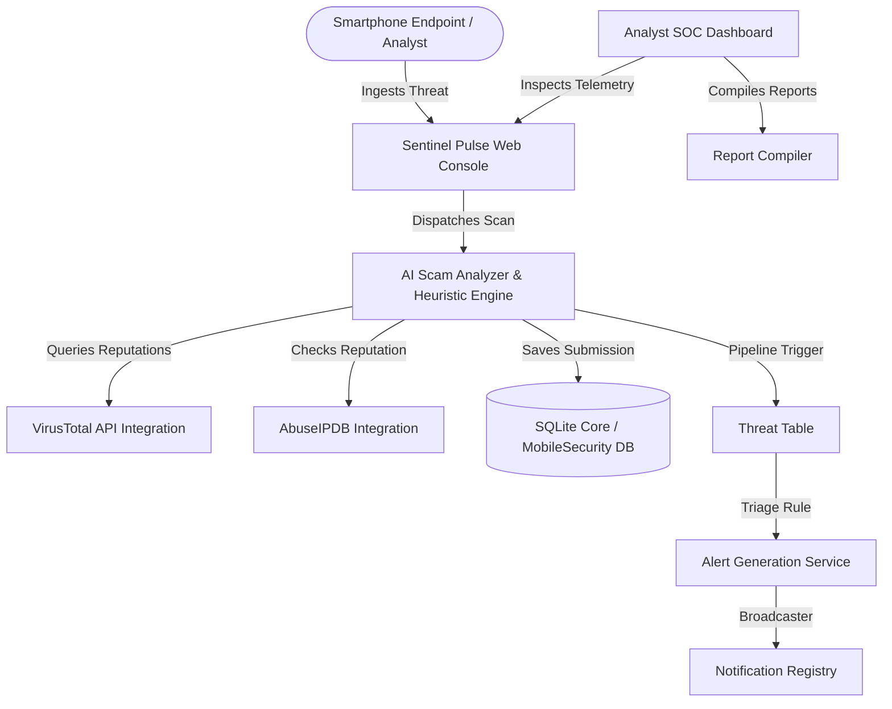

# Sentinel Pulse Mobile Security Architecture

Sentinel Pulse is structured as an enterprise Cyber Security Operations Center (SOC) platform, now extended with smartphone protection telemetry.

## System Topology Diagram

## Component Architecture

### 1. Ingestion Layer
- **Unified Ingestion Endpoint (`/mobile/submit`):** Handles multi-channel uploads (SMS, WhatsApp transcripts, QR destinations, email headers, screenshots, and metadata).
- **Scanners Module:** Specialized web view handlers validating links, files, and transcripts against pattern catalogs.

### 2. Decision & AI Heuristic Engine
- **Heuristics Core (`app/services/ai_scam_analyzer.py`):**
  - **Financial Threat Detection:** Scans text for banking keywords and UPI PIN scams.
  - **Urgency Classification:** Scores fear-inducing statements and grammar substitution markers.
  - **Malware Hashes Check:** Performs SHA-256 signatures cross-reference.

### 3. Pipeline & Threat Correlation
- **Intel Correlation Registry:** Detects repeated URL domain and sender ID attacks.
- **Alert Dispatch Engine:** Automatically translates high-risk mobile threats to SOC alerts.

### 4. Database Layer
- **Core Models (`app/models/mobile_security.py`):**
  - `MobileSubmission`: Stores scan history, parameters, screenshot paths, and AI recommendations.
  - `ThreatIntel`: Holds persistent threat indicators (IPs, hashes, domains) representing blocklists.
