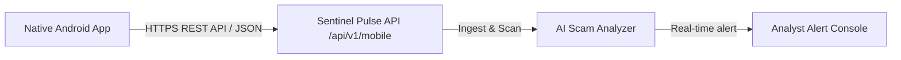

# Sentinel Pulse Future Android Integration Plan

This roadmap outlines the design for native integration between the Sentinel Pulse SOC dashboard and Android mobile endpoints.

## Integration Architecture

## Future Implementation Phases

### Phase 1: Native Android Agent Development
- Build a lightweight native Kotlin/Android app that runs a background listener.
- **SMS Hook:** Listen for incoming SMS messages via `BroadcastReceiver` using the `android.provider.Telephony.SMS_RECEIVED` permission.
- **Clipboard Hook:** Listen for copied text containing URLs using `ClipboardManager`.

### Phase 2: Secure REST API Endpoint
- Implement authentication endpoints under `/api/mobile/login` and `/api/mobile/ingest` requiring API bearer tokens.
- Allow the mobile app to POST intercepted SMS texts or links directly to the scanner database.

### Phase 3: Push Notifications Remediation
- Send real-time warnings from the SOC console back to the Android user using Firebase Cloud Messaging (FCM) to warn them before clicking on newly detected phishing campaigns.
