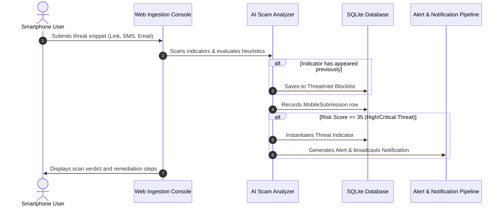

# Sentinel Pulse Mobile Threat Ingestion Workflows

This document outlines the workflows, state transitions, and automated pipeline events triggered when a smartphone threat is ingested.

## Workflow Pipeline Sequence

## State Machine: AI Decision Verdicts

- **`ALLOW` (Score 0-19):** Safe indicator. No alerts are generated.
- **`QUARANTINE` (Score 20-34):** Low-risk anomaly. Saved for inspection.
- **`WARN` (Score 35-59):** Medium-risk warning. Triggers Threat/Alert creation.
- **`BLOCK` (Score 60-79):** High-risk malware or scam. Immediate alert generated.
- **`ESCALATE` (Score 80-100):** Critical campaign. Immediately alerts SOC and dispatches notification.
